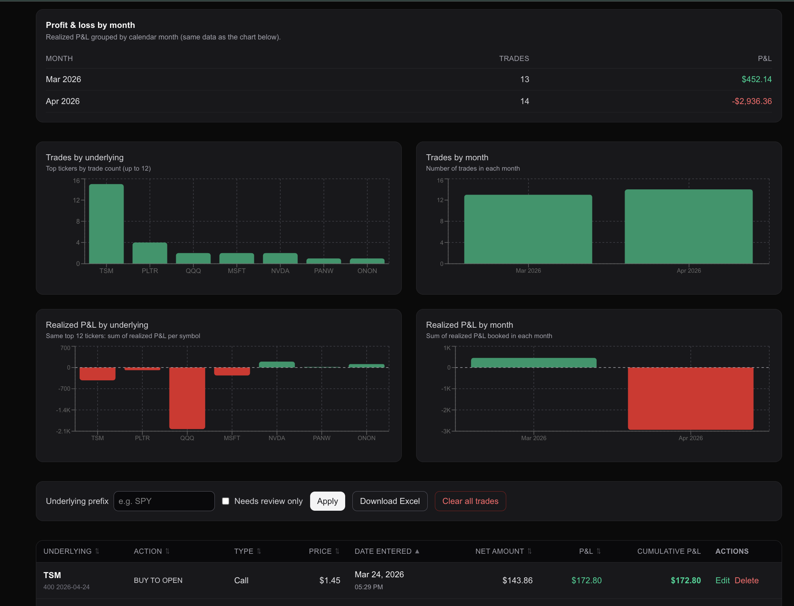

<div align="center">
  <h1>Options Trade Dashboard 📈</h1>

  **An automated, AI-powered options trade journal and analytics dashboard.**

  [](https://nextjs.org/)
  [](https://react.dev/)
  [](https://www.typescriptlang.org/)
  [](https://www.convex.dev/)
  [](https://openai.com/)
  [](https://tailwindcss.com/)
  [](https://vercel.com/)
</div>

---

## 📖 Overview

**Options Trade Dashboard** is a personal Interactive Brokers (IBKR) options journal. Instead of typing legs, strikes, and premiums into a spreadsheet, send a screenshot of an IBKR execution screen to a Telegram bot.

The app downloads the image, runs OpenAI Vision to extract structured trade data, stores it in Convex, and shows performance on a password-protected Next.js dashboard. You can also send IBKR **balance** or **position** screenshots, generate a weekly AI coach review, and backfill options fills from an IBKR Transaction History CSV.

Production: [https://boptiontracker.vercel.app](https://boptiontracker.vercel.app)

## 📸 Screenshots

<div align="center">
  
  <p><em>The live analytics dashboard — monthly P&L summary, Recharts visualisations, account snapshots, weekly coach, and the sortable trade journal with cumulative P&L tracking.</em></p>
</div>

---

## ✨ Key Features

- **Telegram ingest:** Uncaptioned IBKR trade screenshots become journal rows. Photo + caption `balance` or `position` (optional `/snapshot` prefix, case-insensitive) becomes an account snapshot. Text-only messages are ignored.
- **Vision extraction:** Defaults to `gpt-4o` for option legs (underlying, call/put, strike, expiration, side, qty, price, fees, realized P&L) and for snapshot OCR (NLA, margin, greeks).
- **Analytics dashboard:** Monthly P&L, trades and realized P&L by underlying/month, sortable journal (including an **Expiration** column). Negatives show an explicit minus sign. Account snapshots and weekly coach are collapsed by default on mobile.
- **Event-driven live-sync:** Full fetch on open/reload, after edits, and when Convex `dashboardFeed` bumps (for example after Telegram ingest). Hidden tabs defer refresh until visible. No interval polling.
- **Editable journal:** Flag `needsReview`, edit fields, add strategy tags/notes, and mark expired-worthless opens (patches the OPEN row; does not create a separate close). Monthly P&L uses `pnlDate ?? createdAt`.
- **Weekly coach:** On-demand OpenAI review (not on dashboard refresh). Stores narrative + rolling memory; **Start fresh** archives prior reviews and does not wipe trades. Coach logic version lives in `lib/coach-version.ts`.
- **Excel export:** Up to 500 filtered, sorted rows via `exceljs`.
- **IBKR CSV import:** `scripts/import-ibkr-transactions.mjs` imports options-only Transaction History rows (deduped; always `--dry-run` first).

## 🛠️ Tech Stack

| Layer | Stack |
|---|---|
| **Frontend** | [Next.js](https://nextjs.org) 16 (App Router), [React](https://react.dev) 19, TypeScript 5, [Tailwind CSS](https://tailwindcss.com) 4 |
| **Backend & database** | [Convex](https://convex.dev) — schema, queries/mutations, Node actions, file storage |
| **AI** | [OpenAI](https://openai.com/) API (`gpt-4o` default for vision + weekly coach) |
| **Charts & export** | [Recharts](https://recharts.org) 3, [ExcelJS](https://github.com/exceljs/exceljs) |
| **Ingest** | Telegram Bot API (webhook on Next.js). A WhatsApp route exists; Telegram is the live path. |
| **Hosting** | [Vercel](https://vercel.com) (`boptiontracker`) + Convex Cloud |
| **Auth** | Shared-secret login (`DASHBOARD_SECRET`) — same string is the dashboard password |

There is no separate Express / Postgres / Prisma layer. Convex is the database and the API.

## 🚀 Getting Started

### Prerequisites

- Node.js 20+ and npm
- A [Convex](https://dashboard.convex.dev) project
- A [Telegram Bot Token](https://core.telegram.org/bots/tutorial)
- An [OpenAI](https://platform.openai.com/) API key

### Local Development Setup

1. **Clone the repository:**
   ```bash
   git clone https://github.com/limchinhan123/boptiontracker.git
   cd boptiontracker
   npm install
   ```

2. **Configure environment variables:**
   ```bash
   cp .env.example .env.local
   ```
   Convex does **not** read `.env.local`. Set `OPENAI_API_KEY`, `INGEST_SECRET`, and `DASHBOARD_SECRET` in the Convex dashboard for the deployment that matches `NEXT_PUBLIC_CONVEX_URL`. Optional: `OPENAI_VISION_MODEL`, `OPENAI_COACH_MODEL`.

3. **Start Convex (terminal 1):**
   ```bash
   npx convex dev
   ```
   This syncs schema and functions to your Convex **dev** deployment. Use `npx convex deploy` only for production.

4. **Start Next.js (terminal 2):**
   ```bash
   npm run dev
   ```
   Open [http://localhost:3000](http://localhost:3000), log in with `DASHBOARD_SECRET`, and go to `/dashboard`.

## 🤖 Telegram Webhook Configuration

The webhook needs a public HTTPS URL (local `npm run dev` alone is not enough for Telegram).

1. Set `PUBLIC_APP_URL` in `.env.local` to the live origin (e.g. `https://boptiontracker.vercel.app`).
2. Set `TELEGRAM_BOT_TOKEN` and `TELEGRAM_WEBHOOK_SECRET` in `.env.local` and on Vercel.
3. Register the webhook:
   ```bash
   npm run telegram:set-webhook
   ```
4. Send a photo to the bot:
   - **No caption** → trade OCR
   - Caption `balance` or `position` → account snapshot OCR
   - Text-only messages are ignored

## 📥 IBKR CSV import

For backfills, use IBKR **Transaction History** CSV (options only):

```bash
node scripts/import-ibkr-transactions.mjs /path/to/file.csv --dry-run
```

Review the dry-run output, then rerun without `--dry-run`. Rows dedupe on `date|underlying|expiration|strike|side|qty|price`. Worthless expirations have no IBKR close fill — patch the existing OPEN row (`realizedPnl`, `pnlDate` = expiration) instead of inserting a close.

## 🔒 Security & Environment Variables

| Variable | Location | Purpose |
|----------|----------|---------|
| `NEXT_PUBLIC_CONVEX_URL` | Next.js (`.env.local`, Vercel) | Convex deployment the app talks to. Must match the dashboard you configure. |
| `DASHBOARD_SECRET` | Next.js **and** Convex | Dashboard login password and API auth. |
| `INGEST_SECRET` | Next.js **and** Convex | Shared secret for Telegram → Convex ingest. |
| `OPENAI_API_KEY` | **Convex dashboard only** | Vision ingest and weekly coach. |
| `OPENAI_VISION_MODEL` | Convex dashboard (optional) | Defaults to `gpt-4o`. |
| `OPENAI_COACH_MODEL` | Convex dashboard (optional) | Defaults to `gpt-4o`. |
| `TELEGRAM_BOT_TOKEN` | Next.js (Vercel) | Download photos from Telegram. |
| `TELEGRAM_WEBHOOK_SECRET` | Next.js (Vercel) | Validates incoming Telegram webhook requests. |
| `PUBLIC_APP_URL` | Next.js (`.env.local`) | HTTPS origin used by `npm run telegram:set-webhook`. |

Helpers:

- `npm run convex:sync-secrets` / `npm run convex:sync-secrets:prod` — push local secrets to Convex
- `npm run vercel:push-env` — push env vars to Vercel

Vercel production uses project env vars, not `.env.local`. Redeploy after changing them. `git push origin main` deploys the Next app; Convex schema/function changes also need `npx convex dev --once` (dev) or a production Convex deploy against the same `NEXT_PUBLIC_CONVEX_URL`.

## 📚 Documentation & Maintenance

- [`AGENTS.md`](AGENTS.md): Learned preferences, workspace facts, and AI contributor rules.
- [`docs/CLOSEOUT.md`](docs/CLOSEOUT.md): Lint, build, Convex `tsc`, prod env checks, and optional git tags.

## 📄 License

All rights reserved. This is a private project unless an explicit `LICENSE` file is added.

---
*Repo: [github.com/limchinhan123/boptiontracker](https://github.com/limchinhan123/boptiontracker)*
